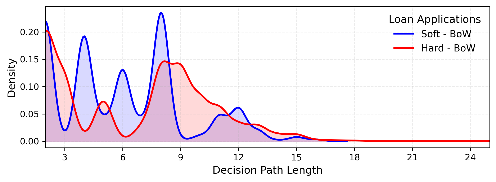

# Applying Knowledge Distillation towards Explainable Predictive Process Monitoring on Event Logs with Textual Attributes

This repository contains the implementation of a knowledge distillation framework designed to enhance the explainability of predictive process monitoring models that leverage textual event log attributes.
Our approach transfers knowledge from a powerful deep learning teacher model, which learns from transformer-based text embeddings, to an interpretable decision tree student model using semantically transparent text representations such as Bag-of-Words, Bag-of-n-Grams, and Latent Dirichlet Allocation, for approximation and interpretation.

This work builds upon the text-aware predictive process monitoring architecture **TAPPBERT** proposed by Cabrera et al. ([*Text-aware predictive process monitoring with contextualized word embeddings*](https://link.springer.com/chapter/10.1007/978-3-031-25383-6_22)), whose source code is available at: [https://github.com/fau-is/tappbert](https://github.com/fau-is/tappbert).

---

## Setup Instructions

1. Create a virtual Python environment.
2. Install the necessary dependencies. This is done automatically in the first cell of the respective Jupyter Notebooks. However, the exact package versions the `requirements.txt` can also be manually installed (tested with Python 3.12).
3. Execute `evaluation.ipynb` to reproduce the steps of the study.

## Datasets

The following event logs are included in the `./data/` directory:

- **Customer Journey:** `werk.xes`
- **Loan Applications:** `bpi_2012_enriched_filtered_A.xes`

> The preprocessing and enrichment code applied to the original BPI 2012 dataset is available in `bpi_enrichment.ipynb`.

---

## Results

All experimental results are saved in:  
`./results/evaluation_results.csv`

This includes performance metrics (accuracy, F1-score) on the true and distilled labels, structural properties of distilled trees (depth, path length), and configuration details for each run.

Visualization plots are provided in the `./img/` directory, such us comparisons of accuracy and F1-score between various student models on the distilled labels:

  
  

To assess the trade-off between performance and interpretability, we also analyze the distribution of path lengths in the distilled decision trees. Shorter paths generally improve human interpretability.

---